# Infera: The Probabilistic Universe Simulator


https://github.com/user-attachments/assets/baeb841b-5cb1-4e5b-93b8-6e1b78a3fd50


*"A world that learns gravity — not one that knows it."*
[](https://infera-jet.vercel.app/)
[](https://en.wikipedia.org/wiki/Bayesian_inference)
[](https://threejs.org/)


## What is Infera?

Infera is an interactive 3D physics sandbox where **particles don't know physics — they learn it**. Each object begins uncertain about fundamental constants like gravity, mass, and friction. Through **Bayesian inference** and **Extended Kalman Filtering**, particles continuously update their beliefs as they observe their own motion.

**The result?** A mesmerizing visualization of scientific discovery itself — watch uncertainty (purple glow) fade into certainty (white light) as the universe learns its own laws.

### Bayesian Learning Process Flow

```mermaid
flowchart TD
    A[Initialize Particle] --> B[Set Prior Beliefs]
    B --> C["State: x = [pos, vel, g, m, f]ᵀ"]
    C --> D["Covariance: P (High Uncertainty)"]
    
    D --> E[Prediction Step]
    E --> F["x̂ₜ|ₜ₋₁ = f(x̂ₜ₋₁|ₜ₋₁)"]
    F --> G["Pₜ|ₜ₋₁ = FₜPₜ₋₁|ₜ₋₁Fₜᵀ + Qₜ"]
    
    G --> H[Observe Motion]
    H --> I["Measurement: zₜ"]
    
    I --> J[Compute Kalman Gain]
    J --> K["Kₜ = Pₜ|ₜ₋₁Hₜᵀ(HₜPₜ|ₜ₋₁Hₜᵀ + Rₜ)⁻¹"]
    
    K --> L[Update Beliefs]
    L --> M["x̂ₜ|ₜ = x̂ₜ|ₜ₋₁ + Kₜ(zₜ - Hₜx̂ₜ|ₜ₋₁)"]
    M --> N["Pₜ|ₜ = (I - KₜHₜ)Pₜ|ₜ₋₁"]
    
    N --> O{Uncertainty < Threshold?}
    O -->|No| P[Continue Learning]
    O -->|Yes| Q[Converged Beliefs]
    
    P --> R[Share with Global Prior]
    R --> S["P(θ|D) ∝ P(D|θ) × P(θ)"]
    S --> E
    
    Q --> T[Stable Physics Knowledge]
    T --> U[Visual: Purple → White]
    
    style A fill:#4d0de0
    style Q fill:#013436
    style T fill:#013436
    style U fill:#013436
    style M fill:#910459
    style N fill:#910459
```



### Core Mathematical Foundation

**State Vector:** Each particle maintains beliefs about:
```
x_t = [position_x, position_y, velocity_x, velocity_y, gravity, mass, friction]ᵀ
```

**Bayesian Update Rule:**
```
P(θ|D) ∝ P(D|θ) × P(θ)
posterior = likelihood × prior
```

**Extended Kalman Filter:**
- **Prediction:** Forecast next motion based on current beliefs
- **Update:** Correct beliefs based on observed reality
- **Convergence:** Uncertainty shrinks as evidence accumulates

### Advanced Features

#### Hierarchical Bayesian Universe
All particles contribute to a shared global consensus about universal constants, modeling how scientific communities form collective knowledge.

#### Real-time Information Theory
- **Entropy Calculation:** H = -Σ P(x) log P(x)
- **Mutual Information:** I(X;Y) between particle beliefs  
- **Convergence Analysis:** Stability metrics and learning rates

#### Symbolic Equation Discovery
The system attempts to rediscover physical laws (like F = ma) from learned data, demonstrating AI-driven scientific discovery.

#### Uncertainty Visualization
Custom algorithms map probability distributions to visual effects:
```glsl
glow_intensity = exp(-variance * decay_factor)
color = mix(purple, white, confidence_level)
```

## Technical Architecture

### Frontend Stack
- **React 19** - Modern UI framework with hooks
- **Three.js** - WebGL 3D rendering and physics visualization  
- **@react-three/fiber** - React renderer for Three.js
- **Tailwind CSS** - Utility-first styling with custom design system
- **TypeScript** - Type-safe development with advanced inference

### Mathematical Engine
- **Custom Extended Kalman Filter** - Nonlinear state estimation
- **Bayesian Inference Engine** - Posterior distribution updates
- **Collision Detection System** - Advanced particle interactions
- **Information Theory Metrics** - Entropy and mutual information

### Performance Optimizations
- **WebGL Instanced Rendering** - Efficient particle systems
- **Frame-rate Monitoring** - Real-time performance metrics
- **Memory Management** - Automatic cleanup and optimization


## Mathematical Deep Dive

### Kalman Filter Implementation
The Extended Kalman Filter handles nonlinear motion dynamics:

**Prediction Step:**
```
x̂_t|t-1 = f(x̂_t-1|t-1)  // Motion model
P_t|t-1 = F_t P_t-1|t-1 F_t^T + Q_t  // Covariance prediction
```

**Update Step:**
```
K_t = P_t|t-1 H_t^T (H_t P_t|t-1 H_t^T + R_t)^-1  // Kalman gain
x̂_t|t = x̂_t|t-1 + K_t(z_t - H_t x̂_t|t-1)  // State update  
P_t|t = (I - K_t H_t) P_t|t-1  // Covariance update
```

### Information-Theoretic Metrics
- **Differential Entropy:** H(X) = -∫ p(x) log p(x) dx
- **Mutual Information:** I(X;Y) = H(X) + H(Y) - H(X,Y)
- **Kullback-Leibler Divergence:** D_KL(P||Q) for belief comparison

## References & Inspiration

- **Kalman Filtering:** R.E. Kalman (1960) - Optimal state estimation
- **Bayesian Inference:** Thomas Bayes (1763) - Probability theory foundations
- **Information Theory:** Claude Shannon (1948) - Mathematical communication theory
- **Scientific Method:** Visual representation of hypothesis testing and belief updating

*Witness a universe discovering itself through probabilistic reasoning.*
